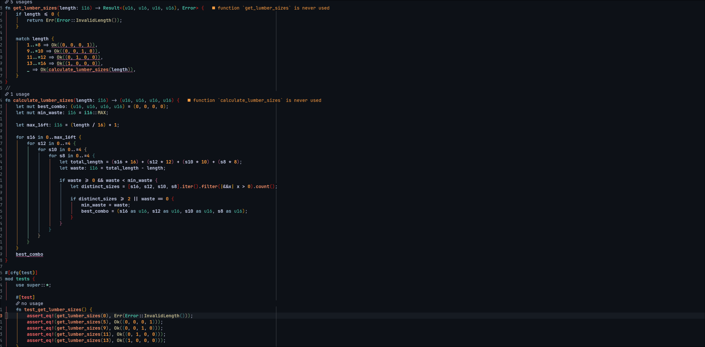

# implicit-return.nvim

A Neovim plugin that highlights implicit return expressions in Rust using Treesitter.

Rust's most idiomatic style — returning the last expression in a block without a `return` keyword — is invisible to standard syntax highlighting. This plugin finds those expressions and gives them a subtle underline so you always know what a function is returning at a glance.



## Features

- Highlights implicit returns in `fn` bodies
- Recurses into `match` arms, `if/else` chains, and nested blocks
- Automatically inherits the underline color from your `@keyword.return` highlight group
- Reacts to file changes in real time
- Respects colorscheme changes

## Requirements

- Neovim >= 0.9
- [nvim-treesitter](https://github.com/nvim-treesitter/nvim-treesitter) with the Rust grammar installed

## Installation

### lazy.nvim

```lua
{
  'ghostvox/implicit-return.nvim',
  ft = 'rust',
  config = function()
    require('implicit_return').setup()
  end,
}
```

### packer.nvim

```lua
use {
  'ghostvox/implicit-return.nvim',
  ft = 'rust',
  config = function()
    require('implicit_return').setup()
  end,
}
```

## Configuration

Call `setup()` with an optional `hl` table to override the highlight style:

```lua
require('implicit_return').setup({
  hl = {
    sp = '#FAA06A',   -- underline color (amber)
    underline = true,
  }
})
```

By default the plugin reads the `sp` or `fg` color from your `@keyword.return` highlight group and uses that as the underline color, so it automatically matches your colorscheme. If no color is found it falls back to `#F77FBE` (pink).

Any valid `nvim_set_hl` options are accepted in the `hl` table:

```lua
require('implicit_return').setup({
  hl = {
    sp = '#4EC9B0',
    underline = true,
    bold = true,      -- also bold the text
  }
})
```

## How It Works

The plugin walks the Treesitter AST on every buffer change, finds `function_item` and `closure_expression` nodes, then recursively resolves the implicit return value:

- For plain expressions it highlights the node directly
- For `match` expressions it recurses into each arm body
- For `if/else` chains it recurses into each branch block
- Semicolon-terminated statements are always excluded

## License

MIT
